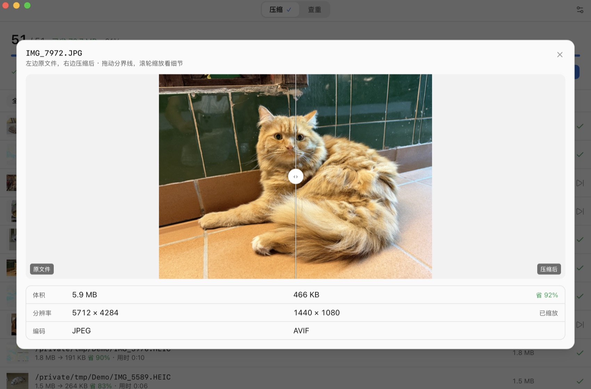

<div align="center">


# ZigZag

把硬盘里的照片和视频批量压小，画面几乎看不出差别。<br/>
照片能小到原来的 1/7，视频 1/5，拍摄时间、地点和相机信息一并保留。

[](https://github.com/idootop/zigzag/releases/latest)
-black)
[](https://tauri.app)
[](https://www.rust-lang.org)




</div>

## 它能做什么

硬盘里归档的照片和视频，是最占空间的一类文件——早年设备的格式效率低，
新相机的原图又动辄几十上百 MB。ZigZag 把它们批量压小，画面看不出差别，照片能小到原来的 1/7，视频 1/5，拍摄时间、地点和相机信息一并保留。

- **先看能省多少** — 开始前先扫一遍，告诉你能腾出多少空间、要花多久，觉得划算再开始
- **压完当场对比** — 拖动分割线看压前压后，放大看细节也行
- **拍摄信息不丢** — 时间、地点、相机、色彩和文件日期原样带走
- **顺手清重复** — 一模一样的和长得很像的都能找出来，删哪张你说了算，删掉的都在废纸篓里
- **关掉能接着跑** — 关掉、重启、断电都行，下次打开点「接着跑」就继续
- **原文件不动** — 压好的放进一个新文件夹，不满意删掉就行

## 安装

> [!TIP]
> 暂不支持 Intel 芯片的 Mac、Windows 和 Linux。


到 [Releases](https://github.com/idootop/zigzag/releases) 下载 `.dmg`，拖进「应用程序」。

首次打开如果提示「已损坏，无法打开」，打开「终端」执行一次即可，之后正常双击：

```bash
xattr -dr com.apple.quarantine /Applications/ZigZag.app
```

## 开发

Tauri 2 + Rust + React 19。前置：Node.js + [pnpm](https://pnpm.io)、[Rust 工具链](https://rustup.rs)。

```bash
pnpm install
pnpm sidecars        # 下载随包的 ffmpeg / ffprobe（约 130 MB，不进 git）

pnpm tauri dev       # 开发模式运行
pnpm tauri build     # 打包，产物在 src-tauri/target/release/bundle/
```

设计文档、决议记录（ADR）与开发日志见 [PROGRESS.md](PROGRESS.md)。

## 实测

打包好的 `.app`、默认档，机器为 Apple M1 Max：

| 类型 | 压到原体积 | 约等于 |
|---|---|---|
| **照片** | 14.3% | **1/7** |
| **视频** | 21.3% | **1/5** |
| **音频** | 14.3% | **1/7** |

画质用客观指标验收：照片 SSIMULACRA2 全部 ≥ 79（90 ≈ 视觉无损），视频 VMAF 96.0 ~ 98.8。
方法、完整数据与可复现脚本见 **[bench/README.md](bench/README.md)**。

## 许可证

MIT
